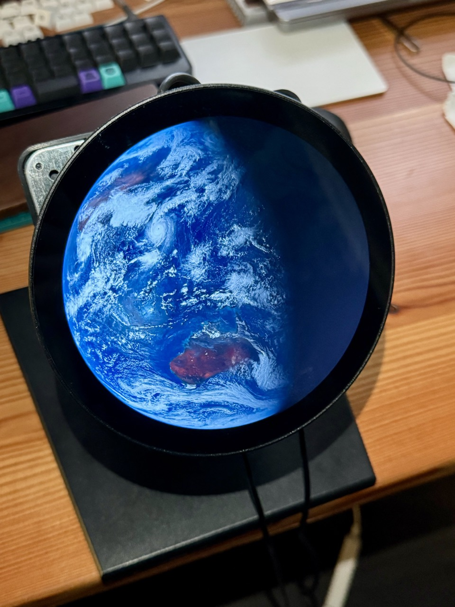

# himawari-rs

気象衛星ひまわり9号が撮影した衛星画像をダウンロードして表示するソフトウェアです。
[こちらのPost](https://twitter.com/sozoraemon/status/1687422013709938688)に影響されて作りました。
Raspberry Pi Zero 2 Wでの動作を目的としています。想定するディスプレイサイズは1080x1080です。


画面中央左上に写っているのは台風14号「コイヌ」です。

## ビルド

手元で実行する場合は`cargo`を使って通常通りビルドできます。

```shell
cargo run
```

Raspberry Pi実機用にクロスコンパイルしてSCPで転送する場合は以下です。

```shell
docker build . -t cargo-cross
./cross-build necocen@nijika.local:/home/necocen
```

末尾の`necocen@nijika.local:/home/necocen`の部分はSCPの宛先です。これで`/home/necocen/himawari-pi`に実行ファイルが転送されます。
